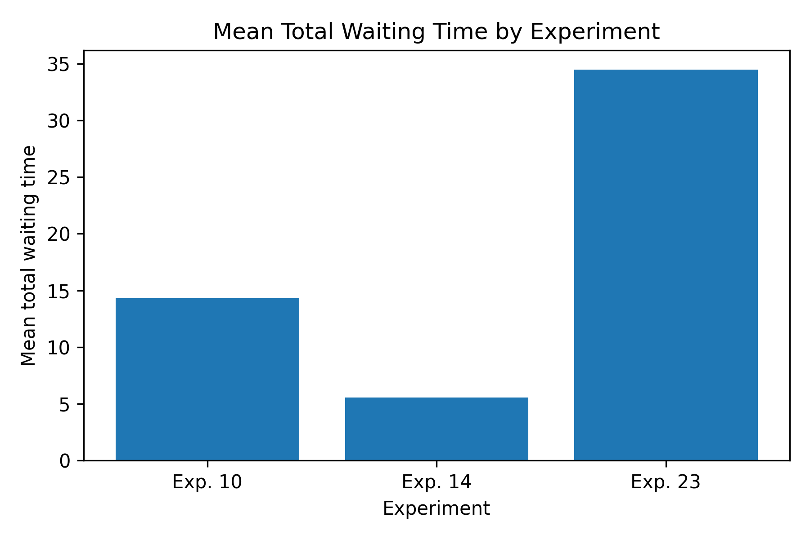
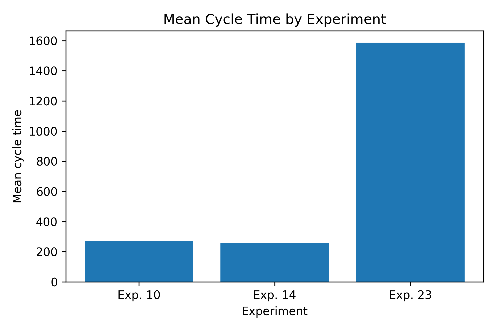
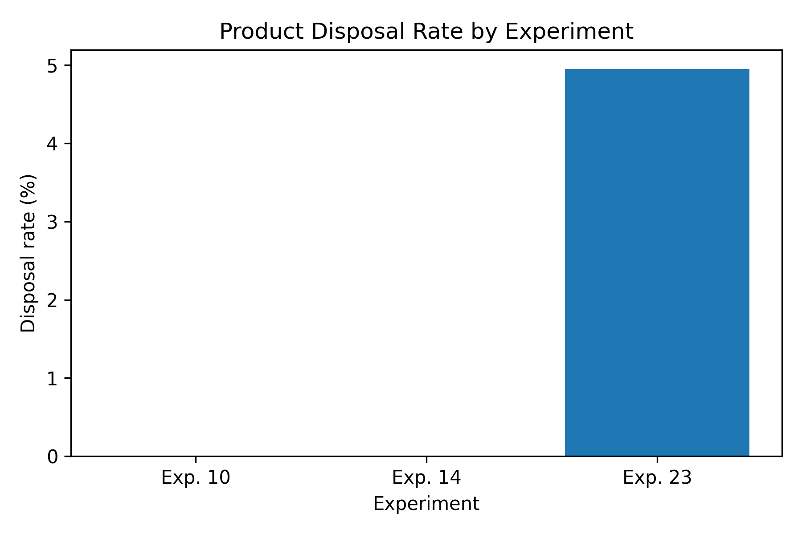

# Process Mining for Quality-Aware Smart-Pallet Logistics

**A reproducible Python and PM4Py analysis of how dispatching rules and fleet composition affect waiting time, cycle time, process stability, and product disposal.**


## Project at a glance

This university group project evaluates a simulated cold-chain logistics process in which quality-sensitive products travel on smart pallets through three regions. The analysis compares a random-dispatching baseline with quality-aware dispatching and an alternative fleet without UAVs.

| Scope | Value |
|---|---:|
| Experiment configurations compared | 3 |
| Simulation runs analyzed | 60 |
| Product cases | 460,342 |
| Process events | 4,915,054 |
| Activities discovered | 11–12 |
| Primary tools | Python, PM4Py, Pandas, Matplotlib, Graphviz |

## Key result

**The quality-aware balanced-fleet configuration (Experiment 14) delivered the strongest overall performance.** Against the random-dispatching baseline, it reduced mean total waiting time by **61.3%**, shortened mean cycle time by **5.3%**, preserved **98.44% exact lifecycle conformance**, and produced **zero disposals**.

| KPI | Baseline: Exp. 10 | Recommended: Exp. 14 | No-UAV: Exp. 23 |
|---|---:|---:|---:|
| Mean total waiting time | 14.32 | **5.54** | 34.46 |
| Mean cycle time | 272.37 | **258.03** | 1,585.85 |
| Exact expected lifecycle | 98.35% | **98.44%** | 85.35% |
| Product disposal rate | **0.00%** | **0.00%** | 4.95% |

The no-UAV configuration created longer queues and less stable product flows. Although its observed quality-decay value was lower, that figure is misleading because 6,668 products were disposed before completion.

## Analysis workflow


The pipeline:

1. Loads warm-up-filtered event logs and experiment outputs.
2. Cleans timestamps, activities, product IDs, vehicle attributes, and quality information.
3. Builds unique case identifiers across experiments and runs.
4. Discovers Directly-Follows Graphs and process variants with PM4Py.
5. Checks traces against the expected product lifecycle.
6. Compares waiting time, cycle time, disposal, quality decay, and vehicle utilization.
7. Generates publication-ready tables, figures, and a final report.

## Selected outputs

<p align="center">
  
  
  
</p>

Directly-Follows Graphs for [Experiment 10](outputs/figures/Exp10_all_runs_dfg.png), [Experiment 14](outputs/figures/Exp14_all_runs_dfg.png), and [Experiment 23](outputs/figures/Exp23_all_runs_dfg.png) show the differences in process stability and incomplete lifecycles.

## Capabilities demonstrated

- **Process mining:** event-log preparation, Directly-Follows Graph discovery, variant analysis, and conformance-style checking
- **Data analysis:** multi-run KPI aggregation, disposal analysis, and vehicle/resource comparison with Pandas and NumPy
- **Reproducible research:** ordered scripts, documented data contracts, generated outputs, and dependency management
- **Data visualization:** analytical figures with Matplotlib and process models with Graphviz
- **Technical communication:** an IEEE-style report that connects analytical findings to operational recommendations

## Repository structure

```text
process-mining-logistics/
├── src/                 # Ordered preprocessing and analysis scripts
├── data/README.md       # Dataset setup and expected folder structure
├── outputs/
│   ├── figures/         # DFGs and KPI charts
│   └── tables/          # Aggregated results and report tables
├── report/
│   ├── process_mining_logistics_report.tex
│   └── process_mining_logistics_report.pdf
├── requirements.txt
└── README.md
```

## Run the analysis

### 1. Set up the environment

```powershell
git clone https://github.com/BoyanChakarov/process-mining-logistics.git
cd process-mining-logistics
py -3.13 -m venv .venv
.\.venv\Scripts\Activate.ps1
pip install -r requirements.txt
```

Graphviz must also be installed and available on the system path. Verify it with `dot -V`.

### 2. Add the source data

The raw simulation dataset is not tracked because of its size. Download and extract it locally under `data/raw/` using the structure documented in [`data/README.md`](data/README.md).

### 3. Reproduce the results

```powershell
python src\02_preprocess_one_log.py
python src\03_discovery_one_log.py
python src\04_preprocess_selected_experiments.py
python src\05_kpi_comparison_selected.py
python src\06_disposal_analysis_selected.py
python src\08_discovery_selected_experiments.py
python src\09_expected_lifecycle_conformance.py
python src\10_vehicle_resource_analysis.py
python src\11_generate_final_report_figures.py
```

Generated artifacts are written to `outputs/tables/`, `outputs/figures/`, and `outputs/xes/`.

## Report and detailed results

The complete methodology, findings, operational recommendations, and limitations are available in the [final report](report/process_mining_logistics_report.pdf).

Key generated tables include:

- [`selected_kpi_report_table.csv`](outputs/tables/selected_kpi_report_table.csv)
- [`selected_disposal_by_experiment.csv`](outputs/tables/selected_disposal_by_experiment.csv)
- [`expected_lifecycle_conformance_pivot.csv`](outputs/tables/expected_lifecycle_conformance_pivot.csv)
- [`vehicle_resource_report_table.csv`](outputs/tables/vehicle_resource_report_table.csv)

## Limitations and next steps

- The event logs come from a simulation, so findings should be validated before applying them to a real logistics operation.
- The current comparison covers 3 of 27 available configurations.
- Warm-up filtering can create traces that start late or end early at simulation boundaries.
- The current case notion centers on products; object-centric process mining could model products and vehicles together.

Future work could extend the pipeline to all experiments and add predictive monitoring for products at risk of excessive quality decay.

## Authors

- Boyan Chakarov — University of Twente
- Johan Tunc — University of Twente
- Sem de Jong — University of Twente
